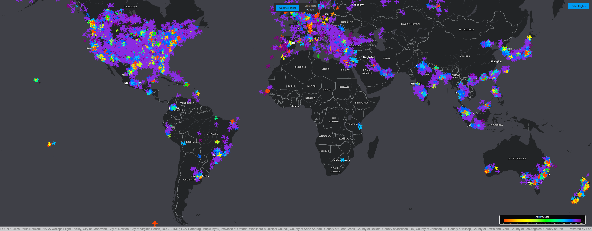

# ✈️ Flight Tracker

A global flight tracking desktop application built using the [ArcGIS Maps SDK for Qt](https://developers.arcgis.com/qt/) and [OpenSky Network](https://opensky-network.org/data/api). The app displays airborne and ground-based aircraft on an interactive map, enriched with intuitive filters and a modern Calcite-styled UI.

---

## 📸 Preview



---

## 🚀 Features

- **Real-time global flight data** from OpenSky Network
- **Flight visualization** with altitude-based color coding and aircraft-type icons
- **Flight info popups** showing detailed metadata:
  - Callsign, ICAO, country, heading, speed, altitude, squawk, etc.
- **Filter panel** with:
  - Country tree filter (continent-wise)
  - Flight status (Airborne / On Ground)
  - Altitude and speed sliders
  - Vertical status (Climbing / Descending / Level)
- **Dark themed modern UI** using [Calcite components](https://github.com/Esri/arcgis-maps-sdk-toolkit-qt)
- Automatically updates and categorizes flights by continent

---

## 🔧 Setup Instructions

Follow the steps below to set up and run the Flight Tracker application locally.

### 1. Clone the Repository

```bash
git clone https://github.com/minnakan/FlightTracker.git
cd flight-tracker
```
### 2. Install ArcGIS Maps SDK for Qt

The app depends on the [ArcGIS Maps SDK for Qt](https://developers.arcgis.com/qt/). Follow these steps:

- Go to: [https://developers.arcgis.com/qt/](https://developers.arcgis.com/qt/)
- Download the SDK appropriate for your platform and Qt version.
- Install and configure the SDK as per the [official installation guide](https://developers.arcgis.com/qt/install/).
- Ensure your development environment (e.g., Qt Creator or CMake) can find the ArcGIS SDK headers and libraries.

### 3. Install ArcGIS Maps SDK Toolkit for Qt (Calcite UI Components)

This project uses Calcite-styled UI components from the ArcGIS toolkit.

Clone the toolkit:

```bash
git clone https://github.com/Esri/arcgis-maps-sdk-toolkit-qt.git
```

Then:

- Link the toolkit into your project using `.pri` (for qmake) or `CMakeLists.txt` (for CMake).
- Ensure `calcite.qrc` is included in your Qt resource file (`.qrc`).
- Make sure your QML files can access Calcite components by importing:

  ```qml
  import "qrc:/esri.com/imports/Calcite" 1.0 as Calcite
  ```

### 4. Create the Config File

You need to create a `config.json` file that contains your API credentials.
**File structure:**

```json
{
  "arcgis": {
    "api_key": "YOUR_ARCGIS_API_KEY"
  },
  "opensky": {
    "client_id": "YOUR_OPEN_SKY_CLIENT_ID",
    "client_secret": "YOUR_OPEN_SKY_CLIENT_SECRET"
  }
}
```
📌 This file is accessed from two locations in the code:

- In `main.cpp`:

  ```cpp
  QFile configFile(":/config/Config/config.json");
  ```
- In `FlightTracker.cpp`: 
  ```cpp
  QFile configFile(":/config/Config/config.json");
  ```

### 5. Set Up OpenSky API

The project uses [OpenSky Network](https://opensky-network.org) for live flight data.

#### Steps:

- Register at: [https://opensky-network.org](https://opensky-network.org)
- Use your `client_id` and `client_secret` in the `config.json` file.
- Authentication uses the OAuth2 **Client Credentials Flow**.

### 6. Build and Run

Use **Qt Creator** or your preferred toolchain to:

- Open the project
- Ensure the ArcGIS SDK and the Calcite toolkit are properly linked
- Build and run the application

✅ That’s it! You should now see live flight data rendered beautifully over a world basemap.

